<!--  -->

# blobob theme
An animated theme for Obsidian!

As a self-taught animator of 7 years, I love seeing motion in interactions.
Since Obsidian is a huge part of my life, I wanted to make it more fun for me (and others).

It supports [Style Settings](https://github.com/mgmeyers/obsidian-style-settings#obsidian-style-settings-plugin) for lots of customization. Blobob Theme is currently in development, so if you find issues or want features or more styles, please create an issue [here](https://github.com/Kazi-Aidah/blobob/issues).

> I'd recommend trying this theme out without reading the rest of the README for surprises.
> THERE ARE 40+ COLOR THEMES INSIDE ( ≧ᗜ≦ )

---

## Settings Tabs
<!-- 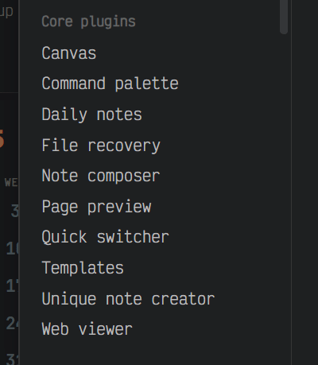 -->
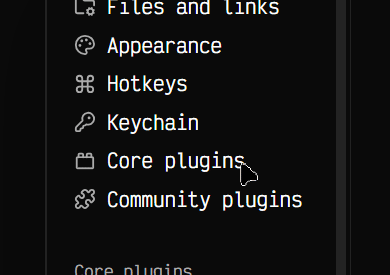

It is animated using ease-in-ease-out and anticipation animation principles.

## Setting Items
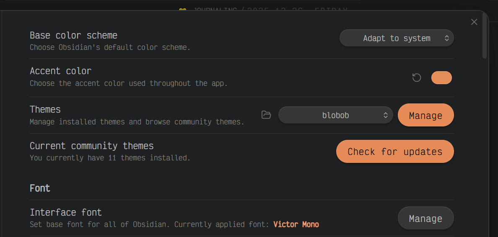

## Right-click Menu
I absolutely love how this looks.
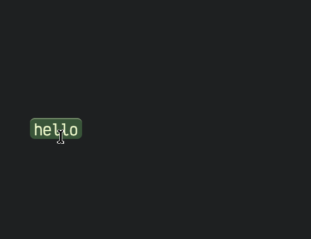

## Toggle Animation
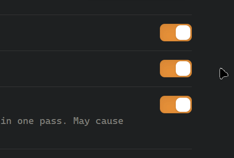

## Checkboxes

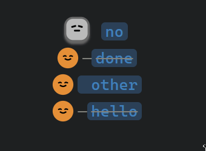

## Hide Nav Buttons
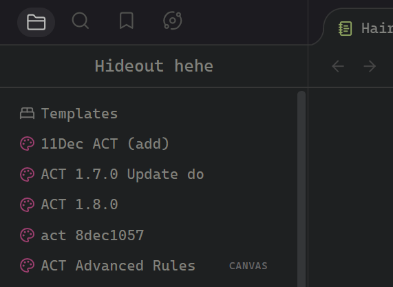

## Animated Tabs
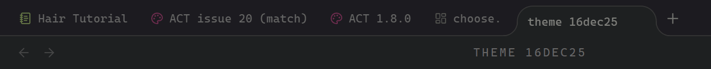

I personally have `Alt + <` and `Alt + >` for easy tab navigation.

## Tab Bar
| 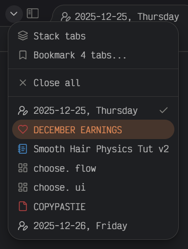 | 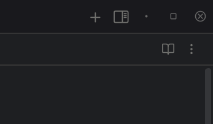 |
| ---------------------------- | ----------------------------- |

**Left:** Fixed stack tabs button along with the left sidebar button (which moves into the sidebar when active).

**Right:** Fixed + Add Tab button & right sidebar button, custom mix-max-close buttons.

Design Idea: Essential buttons should stay fixed.

### Pinned Tabs
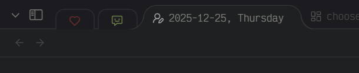

Design idea: Sharp when active, darkened and standing down when inactive (like bodyguards).

## Callout Style
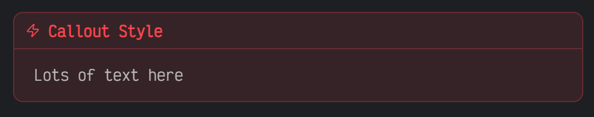

# Style Settings
You can use the [Style Settings](https://github.com/mgmeyers/obsidian-style-settings#obsidian-style-settings-plugin) plugin to activate these extra styles!

## Multiple Theme Colors
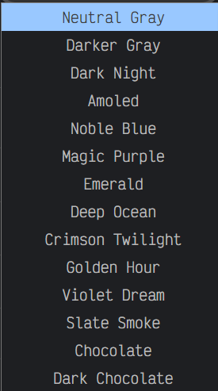

6 Button Styles + 21 Dark Theme Colors 👀 + 25+ Light Theme Colors!!

## Active Line Highlighting
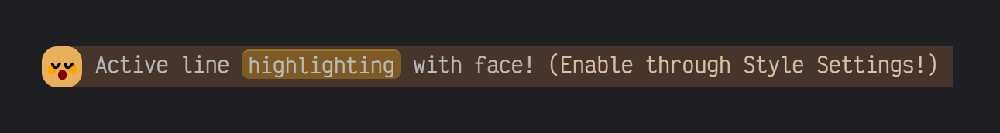

## Active Line Dimming & Floating
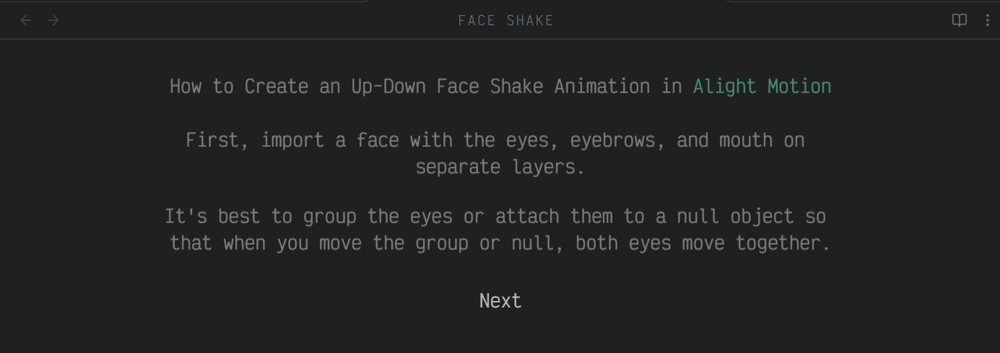

## Properties Styles
The Properties Styling does not affect the "Show File Properties" brought via Command Palette.

Style 1:
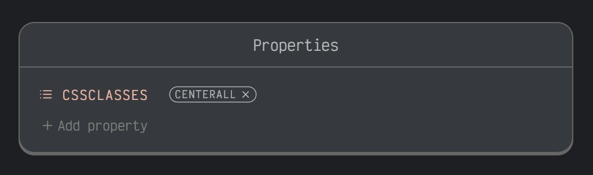

Style 2:
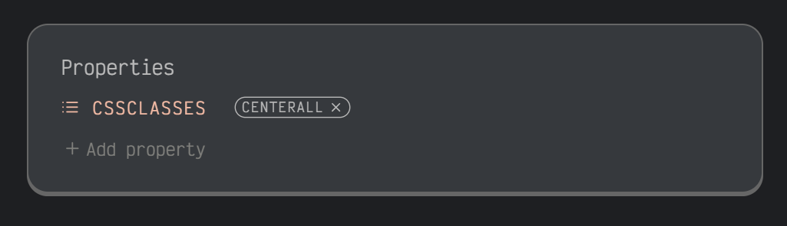

Style 3:
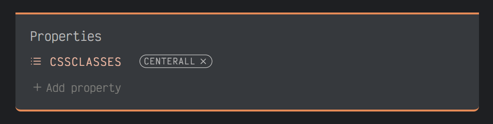

Style 4:
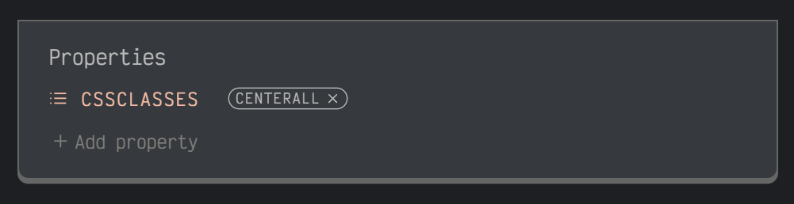

### Cool Properties Features
1. Dim properties unless hovered
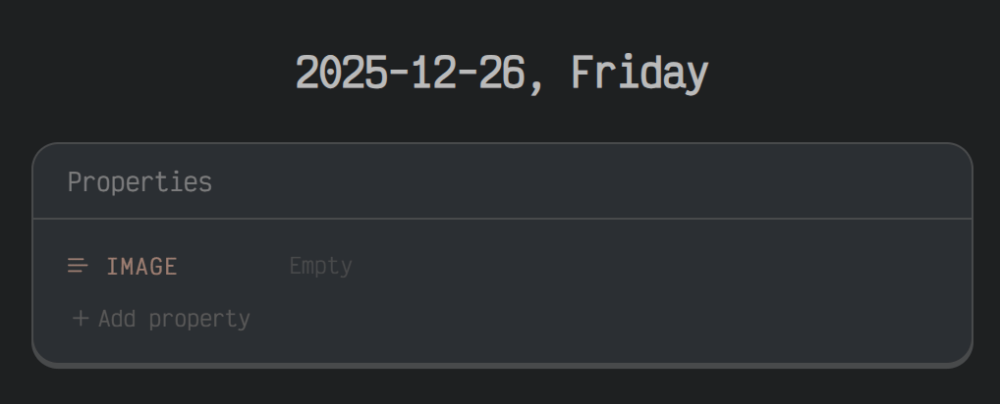

2. Hide arrows in the properties heading
3. Center the properties heading
4. cssclasses & tag styles
5. Metadata key colors

## Folder Styles
| 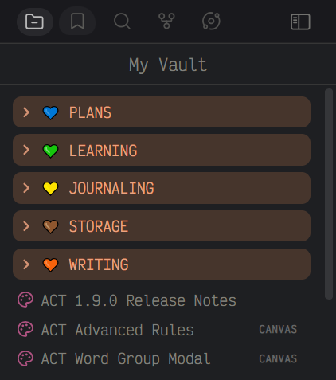 | 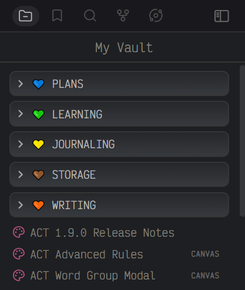 |
| ------------------------------ | -------------------------------- |

<!-- ## Hide Calendar Tab Icon -->

## Custom Bullets
Define Custom Bullets!

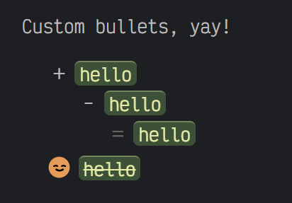

## Hiding
1. Focus Mode – Hides the tab bar, min-max-close buttons & status bar
2. Hide Status Bar - Hides the Status Bar
3. Hide Breadcrumbs - Hides the parent paths in view-header

## Why is the theme named ***blobob***?

I drew **Blob** a long time ago as a simple character concept.

At one point, I planned to turn it into a small animated task-reminder app using Rive, but the idea never went further. The character stayed with me, though.

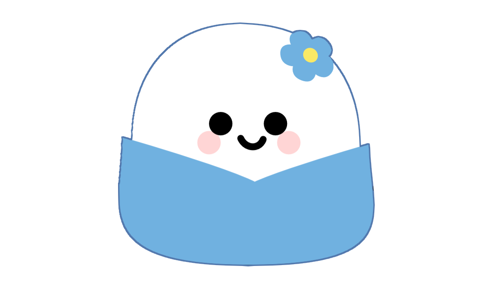

In the theme, the main face you see is the yellow character I named **Bob**:

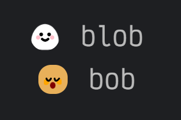

**Blob** is the original concept, **Bob** is the face used in the theme. 
Together, they became **blobob**.
