# blobob theme
An animated theme for Obsidian!

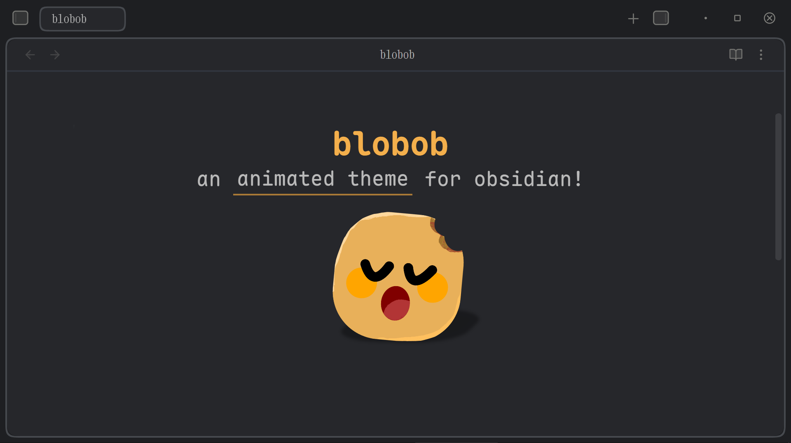

> I'd recommend trying this theme out without reading the rest of the README for surprises.

As a self-taught animator of 7 years, I love seeing motion in interactions. So I created this theme with 70+ colour options and, of course, ANIMATIONS! ( ≧ᗜ≦ )

It supports [Style Settings](https://github.com/mgmeyers/obsidian-style-settings#obsidian-style-settings-plugin) for lots of customization. Blobob Theme is currently in development, so if you find issues or want features or more styles, please create an issue [here](https://github.com/Kazi-Aidah/blobob/issues).

---

## Table of Contents
- [Colour Options (73)](#colour-options-73)
- [Tab Bar](#tab-bar)
  - [Animated Tabs](#animated-tabs)
  - [Compact Tabs & Focus Mode](#compact-tabs--focus-mode)
- [Editor](#editor)
  - [Active Line Styles](#active-line-styles)
  - [Dimmed & Floating Inactive Lines](#dimmed--floating-inactive-lines)
- [File Explorer](#file-explorer)
  - [Bouncy Folders](#bouncy-folders)
  - [Vertical Folder Style](#vertical-folder-style)
  - [Hide Nav Buttons](#hide-nav-buttons)
- [Checkboxes](#checkboxes)
- [Properties](#properties)
- [UI Enhancements](#ui-enhancements)
  - [Settings Tabs](#settings-tabs)
  - [Setting Items](#setting-items)
  - [Right-click Menu](#right-click-menu)
  - [Toggle Animation](#toggle-animation)
- [Mobile](#mobile)
- [About the Name](#about-the-name)

---

## Colour Options (73)
**Note:** Heading colour is peach/pink due to my current Obsidian accent colour. Some themes override it with their own.

> 6 Button Styles + 43 Dark Theme Colours + 30 Light Theme Colours!!

### Dark Theme Colours

| **Amoled**  | **Darker Gray**  |
|-----------------------------------------------|---------------------------------------------------------|
| **Neutral Gray** 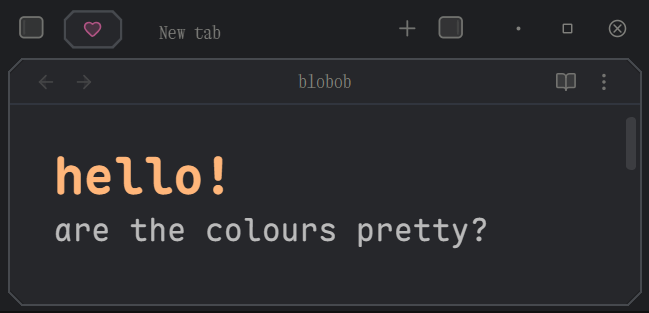 | **Slate Smoke** 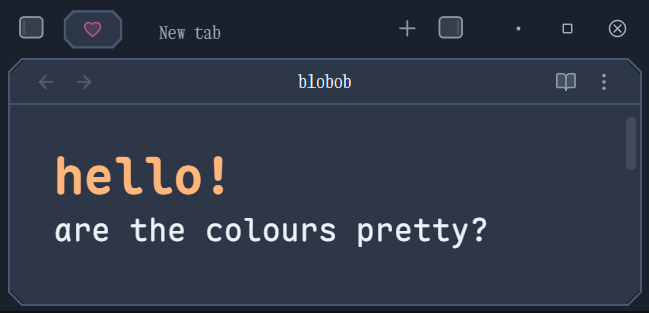 |
| **Arctic Ice** 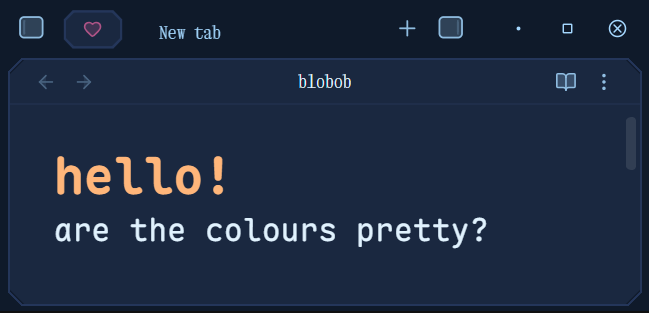 | **Noble Blue** 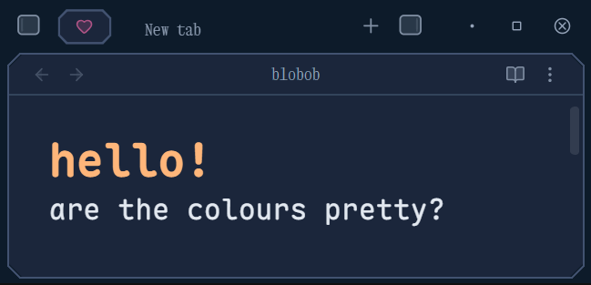 |
| **Cold Memory** 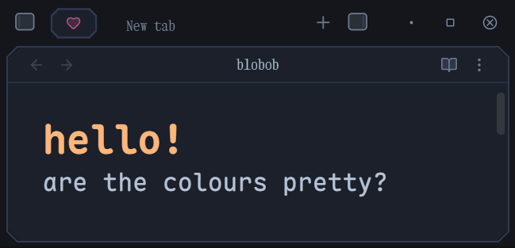 | **Dark Night** 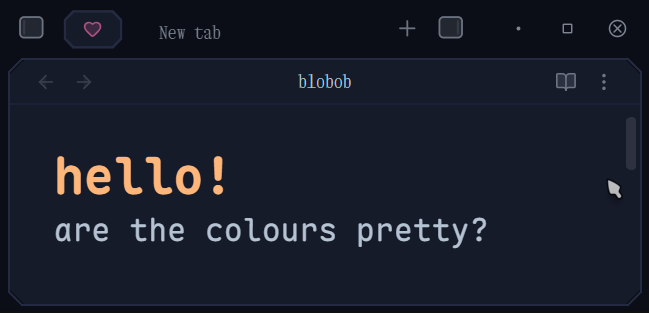 |
| **Deep Blue** 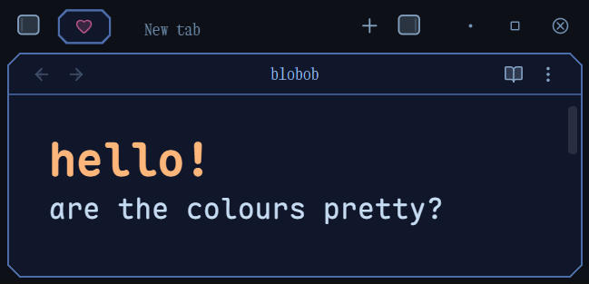 | **Deep Purple** 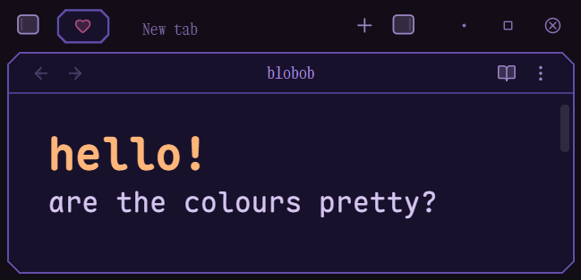 |
| **Violet Dream** 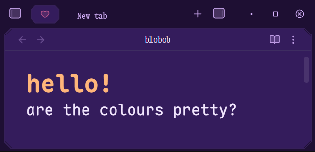 | **Magic Purple** 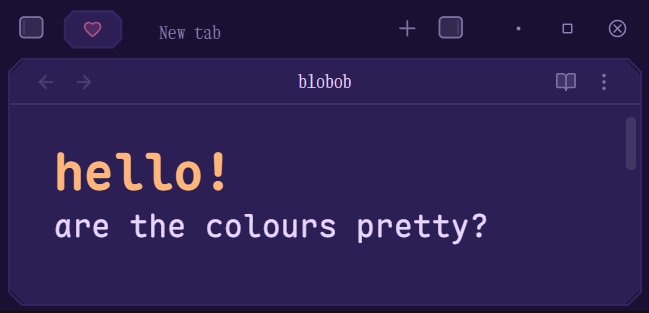 |
| **Nocturne** 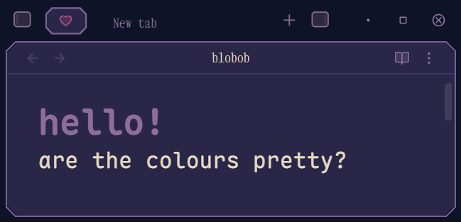 | **Lavendar**  |
| **Emerald**  | **Muted Green** 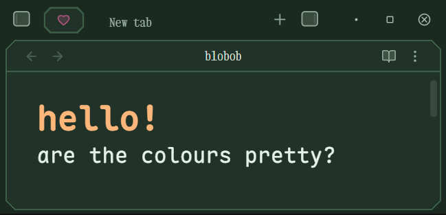 |
| **More Olives** 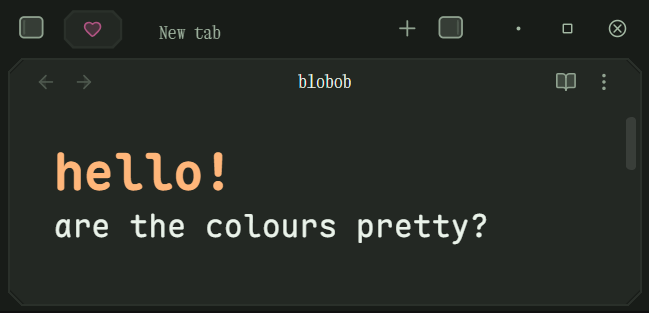 | **Greenwood** 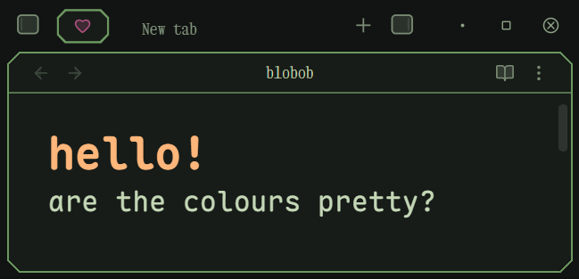 |
| **Viridian Regalia** 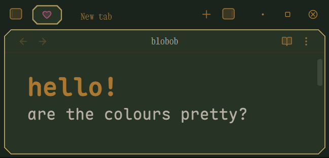 | **Deep Green** 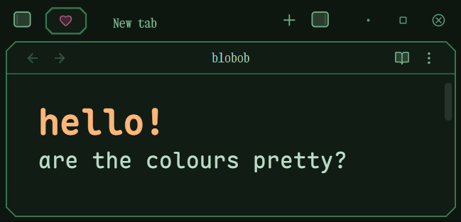 |
| **Lime** 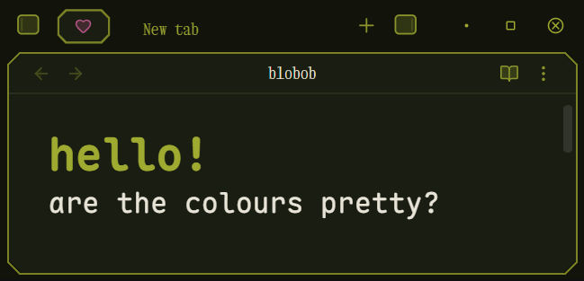 | **Rose Gold** 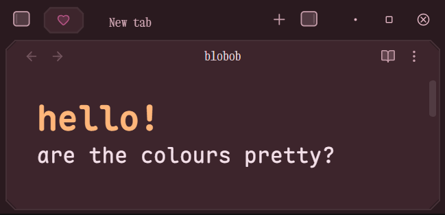 |
| **Crimson Twilight** 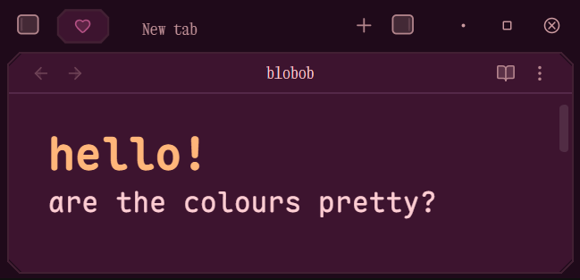 | **Wine**  |
| **Deep Hotpink** 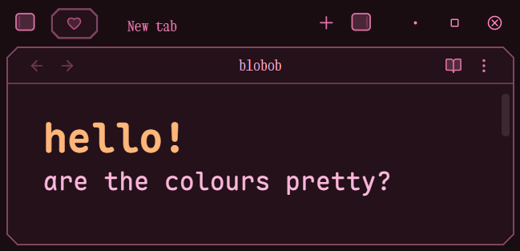 | **Deep Magenta** 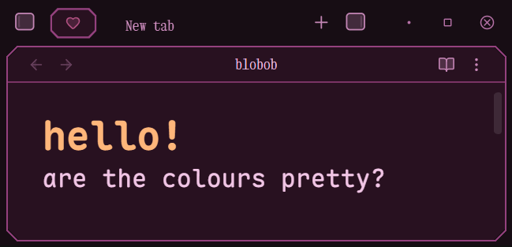 |
| **Urban** 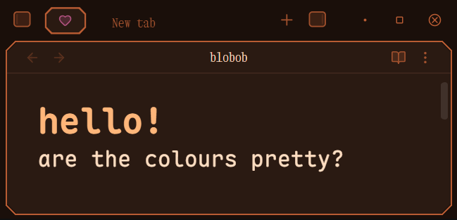 | **Citrine** 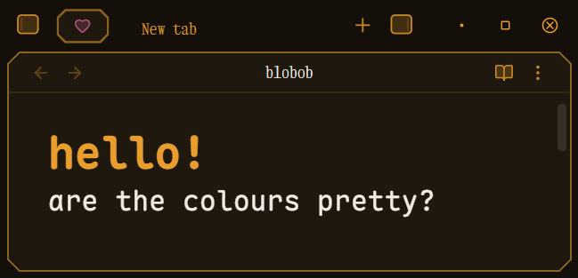 |
| **Golden Earth** 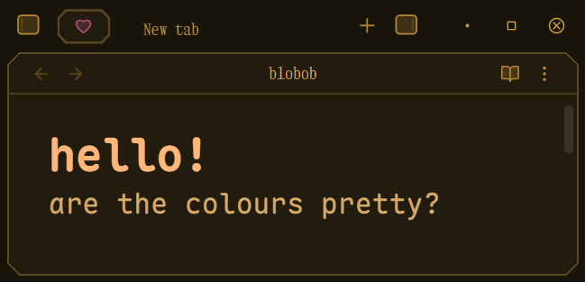 | **Golden Hour** 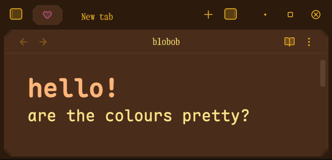 |
| **Caramel**  | **Chocolate**  |
| **Dark Chocolate** 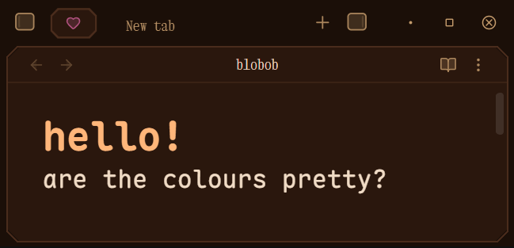 | **Comfort Chocolate** 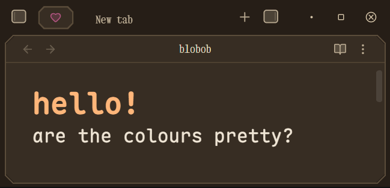 |
| **Tasty Chocolate**  | **Tasty Chocolate 2** 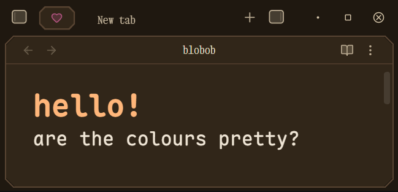 |
| **Leather**  | **Velvet Maroon** 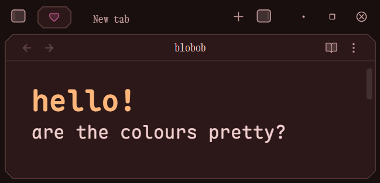 |
| **Deep Red** 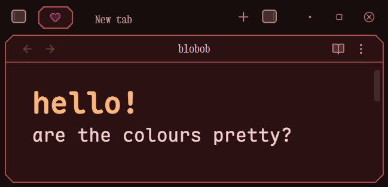 | **Mafia Red** 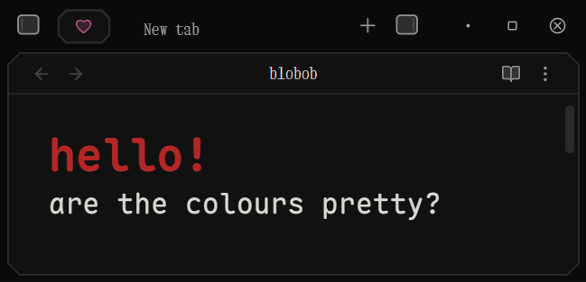 |
| **Red Forest** 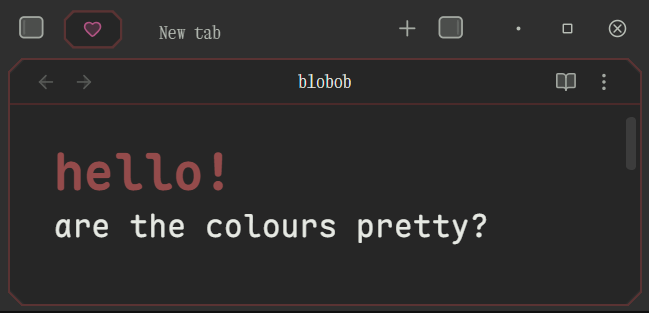 | **Green Road** 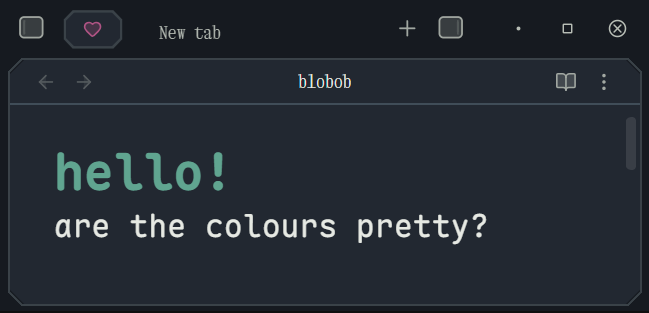 |

### Light Theme Colours

| **Cloud White** 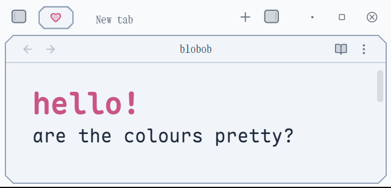 | **Paper White** 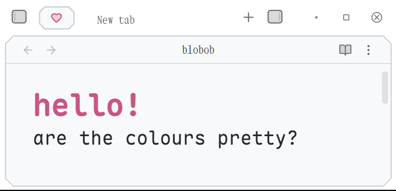 |
|---------------------------------------------------------|---------------------------------------------------------|
| **Light Gray** 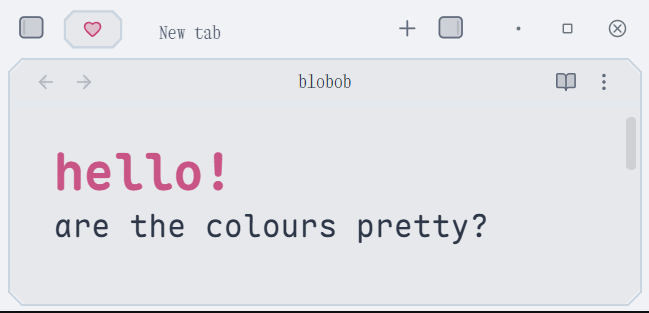 | **Sand**  |
| **Peach**  | **Yellow**  |
| **Green**  | **Cyan**  |
| **Blue**  | **Azure**  |
| **Purple**  | **Pink**  |
| **Brinjal** 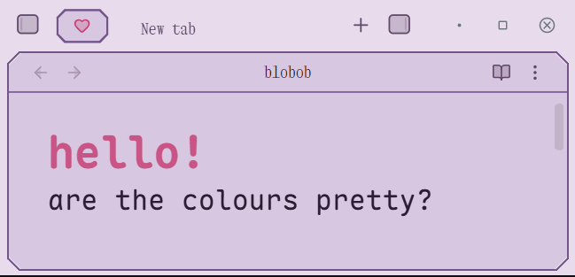 | **Herb**  |
| **Olive**  | **Jade**  |
| **Rose**  | **Joy** 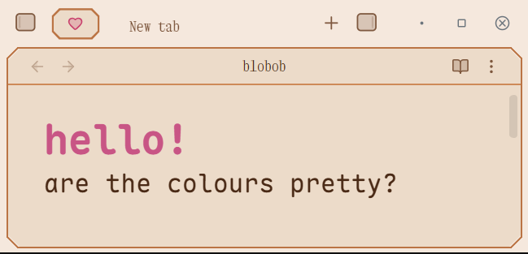 |
| **Choco Milk** 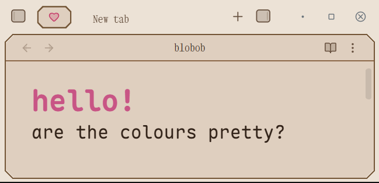 | **Yellow Teeth** 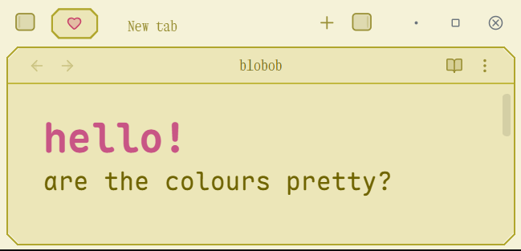 |
| **Toothpaste**  | **Blood**  |
| **Corporate**  | **Disgust**  |
| **Payesh**  | **Chicken**  |
| **Cream**  | **Cream Blue**  |
| **50% Gray** 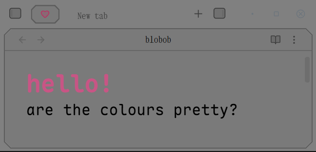 | **Delta** 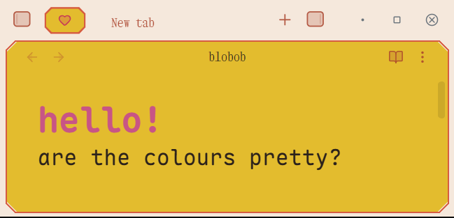 |

### My Favourites
**Dark Themes:** Dark Night, Golden Earth, Crimson Twilight, Cold Memory, & Mafia Red

**Light Themes:** Payesh, Chicken, Corporate, Yellow Teeth

---

## Tab Bar

### Animated Tabs
**Joined**

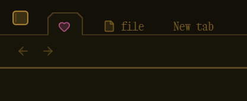
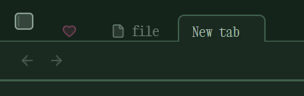

**Floating**

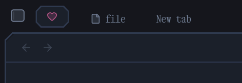
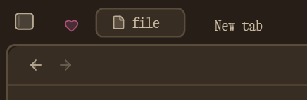

**Underlined**

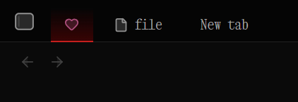
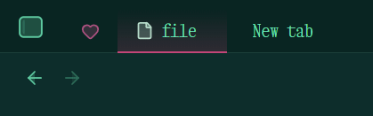

**Contained**

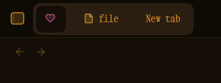

### Compact Tabs & Focus Mode
Don't like how much space the tab bar takes up? Enable Compact Tabs!


Or enable Focus Mode!


---

## Editor

### Active Line Styles
You can blur, center & make the active line bigger!


Check out several active line styles:


### Dimmed & Floating Inactive Lines

---

## File Explorer

### Bouncy Folders
Lots of folder styles with bouncy animations!


### Vertical Folder Style


### Hide Nav Buttons

---

## Checkboxes


---

## Properties
The Properties styling does not affect the "Show File Properties" brought via Command Palette.

---

## UI Enhancements

### Settings Tabs


### Setting Items

### Right-click Menu
I absolutely love how this looks.

### Toggle Animation

---

## Mobile
You can hide the buttons you don't need through Style Settings.


### Mobile Views

| Gallery View | List View |
|--------------|-----------|
|  |  |

---

## About the Name

I loved the blob I drew.

In the theme, the main face you see is the yellow character I named **Bob**:

**Blob** is the original concept, **Bob** is the face used in the theme.
Together, they became **blobob**.
